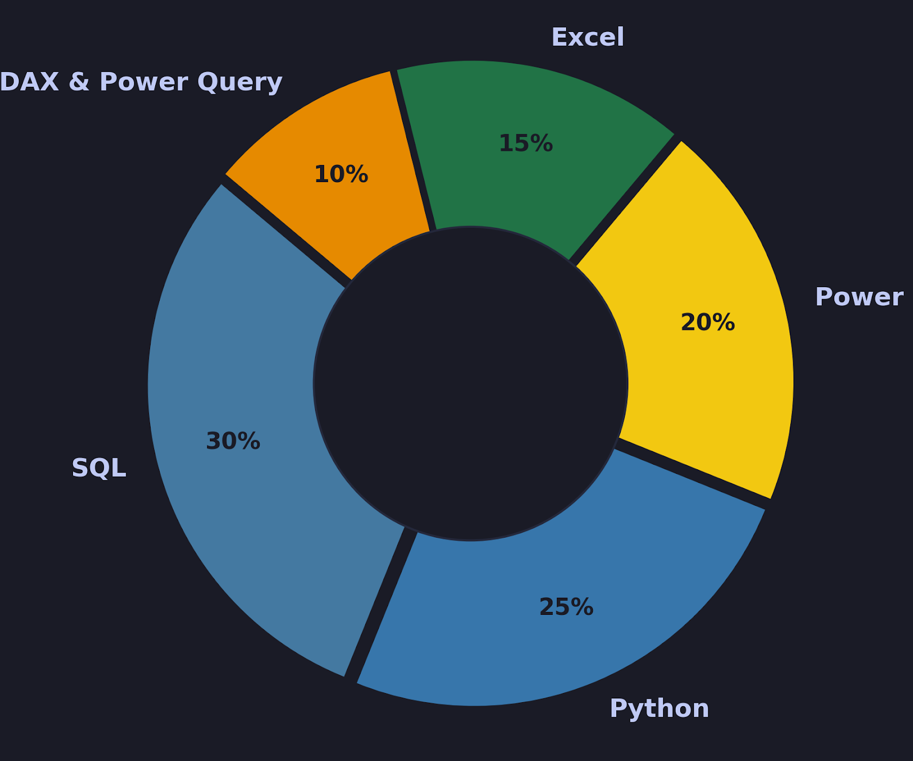

# Hi folks, I'm Rajay Ajay Jain! 👋 ✨

---

  

---

## 🔗 About Me
------

I am a passionate & aspiring **Data Analyst** from **Goa, India**, dedicated to optimizing queries and finding the *stories & why* hidden within numbers. I transform raw data into clear, actionable business strategies using analytical tools.

- 🎓 B.Tech in Electrical Engineering
- 📊 Passionate about Data Analytics & Business Intelligence
- 💼 Experienced in Power BI Dashboard Development
- 🌱 Currently strengthening skills in SQL, Python & Data Engineering
- 📈 Love transforming raw data into actionable insights
- 🎯 Targeting Data Analyst roles at top companies
- ⚡ Fun Fact: I enjoy turning complex datasets into simple business stories
---

### 🛠️ Tech Stack & Toolkit

  <!-- Languages -->
  
  
  
  <!-- Tools & Libraries -->
  
  
  
  
    
  
  <!-- Platforms -->
  

---

### 📂 Featured Data Projects

Here is a look at what I've been building across my 10 repositories:

---

## 🛒 Blinkit Sales Analysis
🔗 [View It Here 🔎](https://github.com/RajayJain/Blinkit_Analysis)

- Analyzed **8,523 retail transactions** generating **$1.20M+ in total sales** across multiple outlet types and product categories.
- Built an executive Power BI dashboard featuring **15+ KPIs**, including Total Sales, Average Sales, Outlet Performance, Customer Ratings, and Inventory Distribution.
- Developed advanced DAX measures and interactive visualizations to identify top-performing product categories and revenue-driving outlets.
- Delivered actionable business insights that improved visibility into sales trends, outlet efficiency, and customer purchasing behavior.

---

## 📈 Power BI Data Analytics
🔗 [View It Here 🔎](https://github.com/RajayJain/Power_BI_Data_Analytics)

- Designed and developed multiple end-to-end Power BI solutions covering data extraction, transformation, modeling, and business reporting.
- Created **15+ DAX measures and KPIs** to track revenue, profitability, customer performance, and operational efficiency.
- Implemented star-schema data models and optimized report performance using Power Query and advanced DAX techniques.
- Built interactive dashboards with drill-through functionality and dynamic filtering, enabling data-driven decision-making for stakeholders.

---

## 🏪 Walmart Sales Data Analysis
🔗 [View It Here 🔎](https://github.com/RajayJain/Walmart_Sales_Data_Analysis)

- Analyzed **1,000+ customer transactions** across multiple Walmart branches to evaluate revenue performance and consumer purchasing behavior.
- Performed exploratory data analysis using SQL and Power BI to uncover sales trends, customer preferences, and product demand patterns.
- Identified peak sales periods, top-performing product lines, and branch-level performance opportunities through data-driven insights.
- Developed an interactive business dashboard with **10+ key performance metrics** supporting strategic planning and operational monitoring.

---

## 📊 Excel Salary Dashboard
🔗 [View It Here 🔎](https://github.com/RajayJain/Excel_Salary_Dashboard)

- Analyzed survey data from **630+ data professionals** across various countries, experience levels, and job roles.
- Built a fully interactive Excel dashboard using **Pivot Tables, Power Query, Slicers, and Dynamic Charts** to visualize compensation trends.
- Automated data preparation and transformation workflows, reducing manual analysis effort by approximately **80%**.
- Generated insights into salary benchmarks, high-paying skills, and regional compensation differences within the data analytics industry.

---

### 📊 Skill Distribution & Ecosystem

  
  

 

---

### 📜 Certifications

🏅 [Microsoft Power BI Data Analyst](https://coursera.org/share/dd4948e7bc59c858df5fbcd702e8c7b7)  
🏅 [SQL for Data Analytics](https://github.com/RajayJain/Assets/blob/88227ee072c98afe646b790cbc6132d07f7ef78e/SQL.pdf)  
🏅 [Data Analytics Professional Certificates](https://github.com/RajayJain/Assets/blob/88227ee072c98afe646b790cbc6132d07f7ef78e/Data%20Analytics.pdf)    
🏅 [Python for Data Analysis](https://coursera.org/share/c8f170525eb8e9326becee56725b5302)

---

### 📈 Contribution Graph

---

### 🌐 Let's Connect!

Feel free to reach out if you want to collaborate on a data project, discuss query optimization, or talk about market insights!

 

***

#### 💡 Quote of the Day  

---
